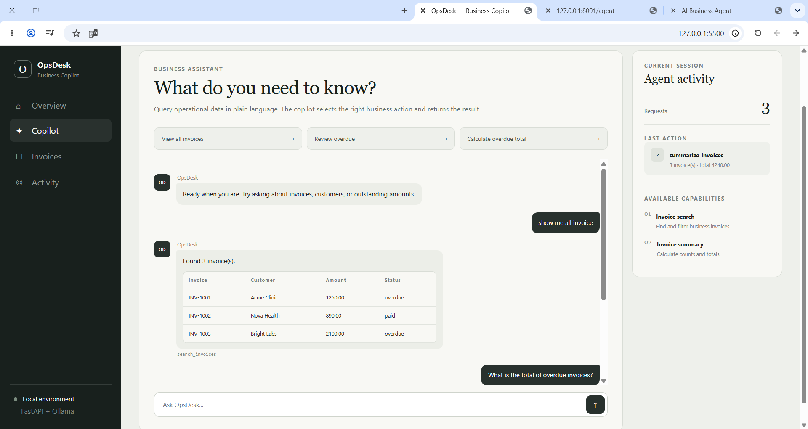
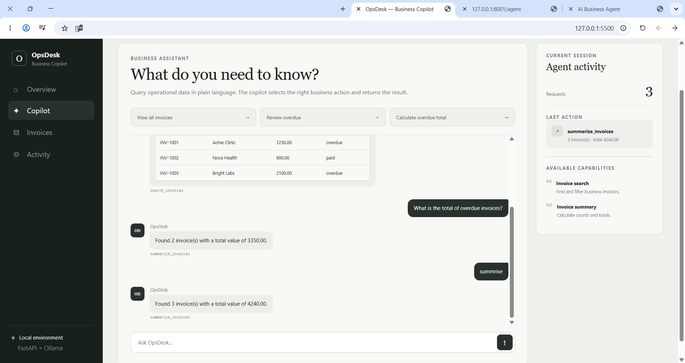
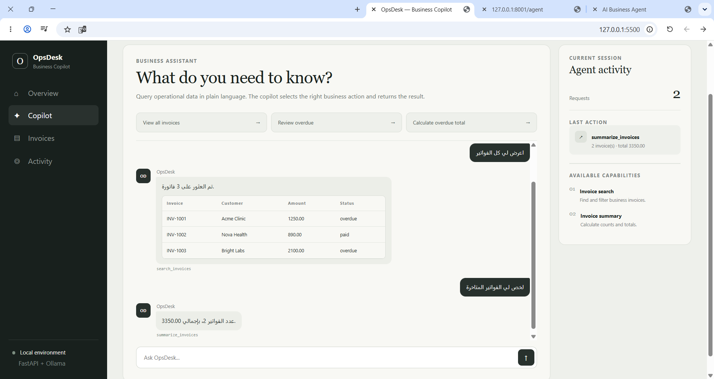

# AI Business Agent

A local AI business agent that understands natural-language requests, selects the appropriate business tool, executes it, and returns structured operational results.

Built with **Python, FastAPI, Ollama/Qwen, and a lightweight web interface**.

## Features

* Natural-language business queries
* AI-driven tool selection
* Flexible invoice search and filtering
* Invoice summaries and totals
* Arabic and English query support
* Local LLM inference with Ollama
* Structured tool execution
* FastAPI REST backend
* Responsive browser-based interface
* No real customer or company data

## Architecture

```text
User
  ↓
Browser UI
  ↓
FastAPI
  ↓
Ollama / Qwen
  ↓
Tool Selection
  ↓
Business Tools
  ↓
Structured Result
  ↓
UI
```

The LLM interprets the user's intent and selects an approved business tool. The tool performs the operation, then the result is returned to the interface.

## Screenshots

### Natural-Language Invoice Search



### AI Agent Tool Calling



### Arabic Query Support



## Tech Stack

**Backend:** Python, FastAPI, Pydantic
**AI:** Ollama, Qwen
**Agent Architecture:** Tool Calling, Structured Outputs
**Frontend:** HTML, CSS, JavaScript
**API:** REST

## Available Agent Capabilities

### Search Invoices

The agent can search and filter invoices using natural-language requests.

Examples:

```text
Show me all invoices
Show overdue invoices
Look up invoice INV-1001
اعرض كل الفواتير
اعرض الفواتير المتأخرة
اعرض تفاصيل الفاتورة INV-1001
```

### Summarize Invoices

The agent can calculate counts and totals based on invoice data.

Examples:

```text
What is the total of overdue invoices?
كم مجموع الفواتير المتأخرة؟
```

## Run Locally

### 1. Create a virtual environment

```powershell
python -m venv .venv
.venv\Scripts\activate
```

### 2. Install dependencies

```powershell
python -m pip install -r requirements.txt
```

### 3. Start Ollama

Make sure Ollama is installed and the required model is available.

```powershell
ollama run qwen3:8b
```

### 4. Start the FastAPI backend

```powershell
python -m uvicorn app.main:app --reload --port 8001
```

Backend:

```text
http://127.0.0.1:8001
```

API documentation:

```text
http://127.0.0.1:8001/docs
```

### 5. Start the frontend

Open another terminal:

```powershell
cd frontend
python -m http.server 5500
```

Then open:

```text
http://127.0.0.1:5500
```

## Project Structure

```text
ai-business-agent/
│
├── app/
│   ├── __init__.py
│   ├── agent.py
│   ├── main.py
│   └── tools.py
│
├── frontend/
│   ├── index.html
│   ├── style.css
│   └── app.js
│
├── screenshots/
│   ├── invoice-search.png
│   ├── tool-calling.png
│   └── arabic-query.png
│
├── tests/
│   └── test_tools.py
│
├── .env.example
├── .gitignore
├── requirements.txt
└── README.md
```

## Example Agent Flow

```text
User:
"What is the total of overdue invoices?"

        ↓

Qwen interprets the request

        ↓

Tool selected:
summarize_invoices

        ↓

Arguments:
status = overdue

        ↓

Business tool executes

        ↓

Structured result returned to the user
```

## Why This Project

This project demonstrates how an LLM can be connected to real application logic instead of being used only as a chatbot.

The model is responsible for understanding intent and selecting approved tools, while business operations remain controlled by application code.

This architecture can be extended to workflows such as:

* CRM operations
* order management
* customer support
* payment workflows
* reporting
* business automation

## Privacy

This project uses mock invoice data only.

No real customer, healthcare, financial, or company data is included.
